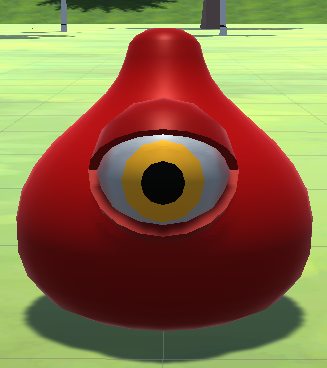
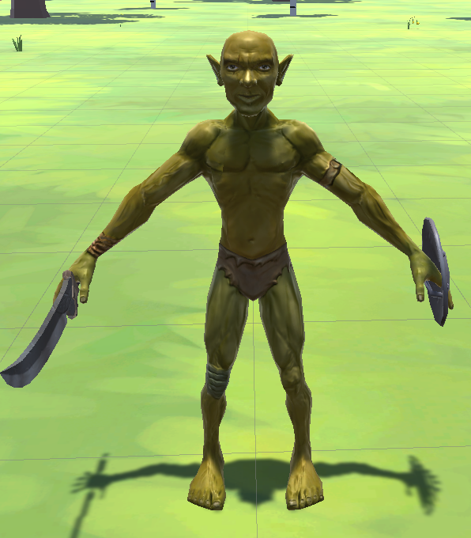
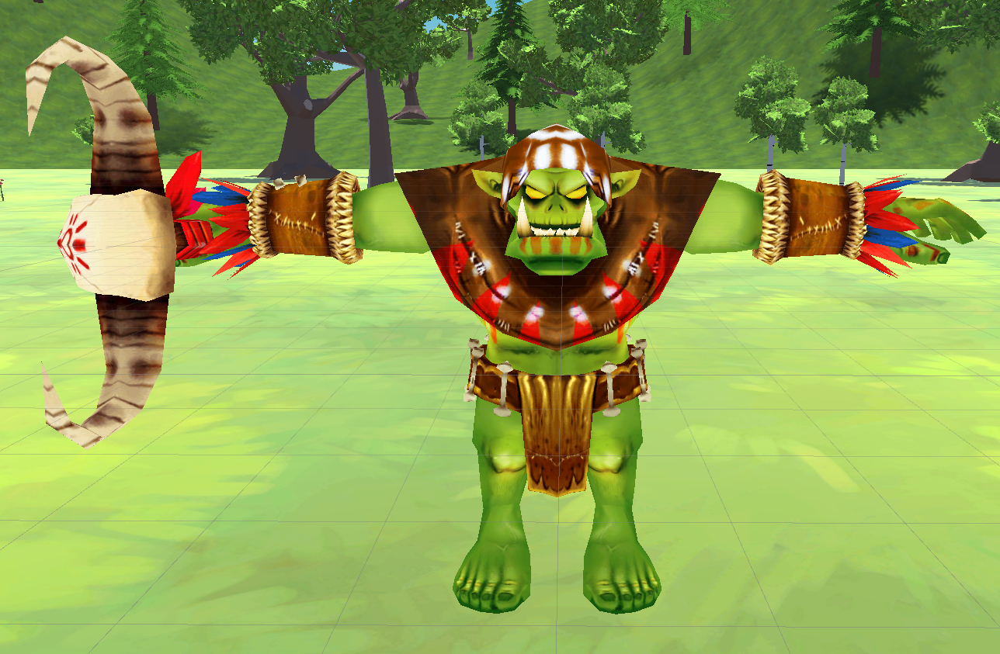
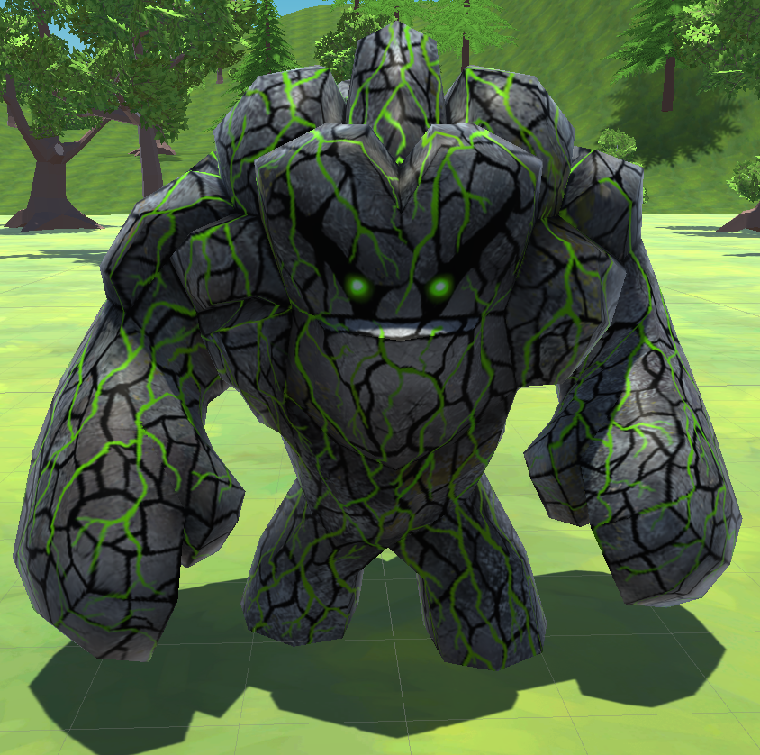
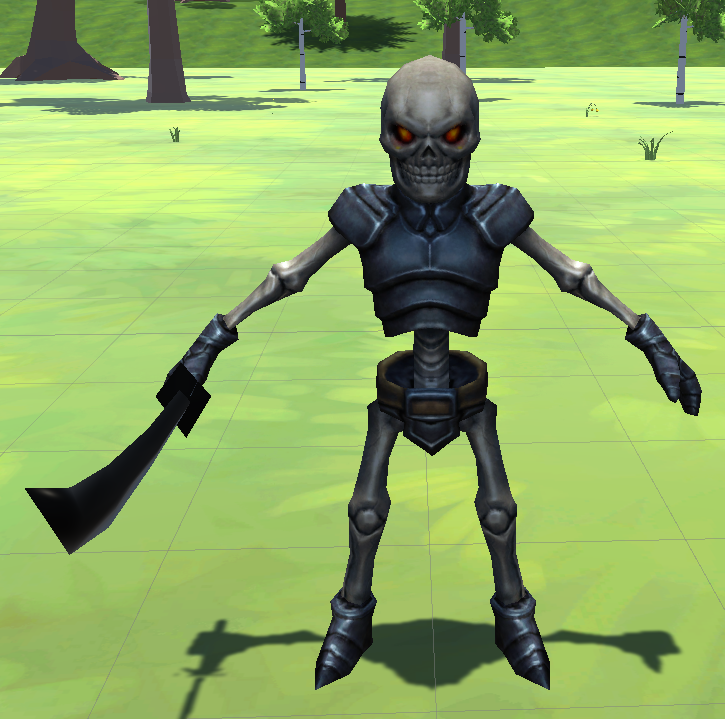
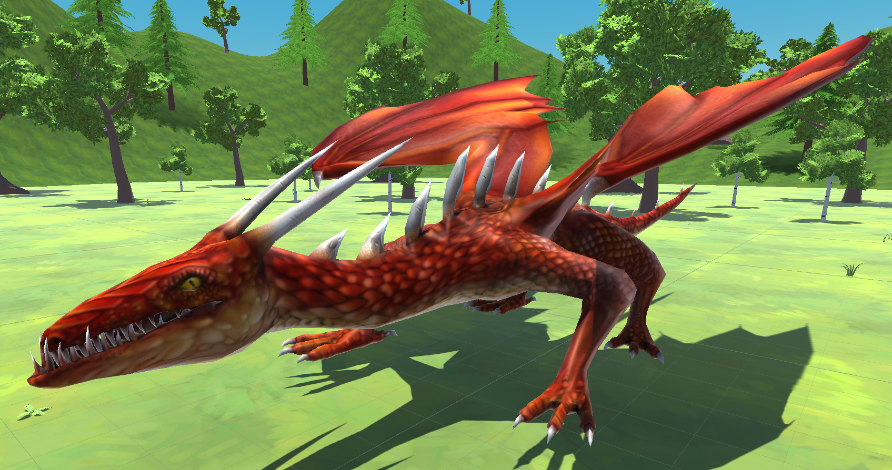
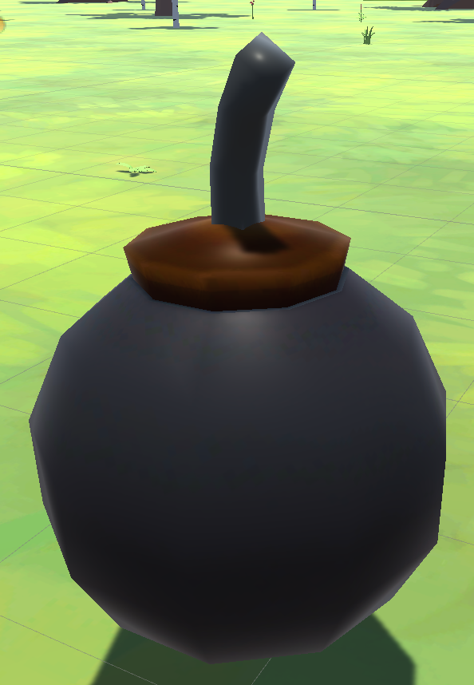

# 레전드 오브 슬래셔 (오단해)

## 목차
- [프로젝트명 : 레전드 오브 슬래셔](#프로젝트-명--레전드-오브-슬래셔)

- [포스터](#포스터)

- [1분 홍보 영상](#1분-홍보-영상)

- [컨셉](#컨셉)

- [관련 이미지 & 동영상](#관련-이미지--동영상)

- [대표 이미지](#대표-이미지)

- [타이틀 화면](#타이틀-화면)

- [컨셉 and 대표이미지 기반 작품묘사](#컨셉--대표이미지-기반-작품묘사)

- [레전드 오브 슬래셔 구성 요소](#레전드-오브-슬래셔-구성-요소)

- [게임조작 방법](#게임조작-방법)

- [적들의 종류](#적들의-종류)

- [아이템 종류](#아이템-종류)

- [스테이지 별 등장 적과 특이사항](#스테이지-별-등장-적과-특이사항)

- [인게임 스크린샷](#인게임-스크린샷)

- [게임 시스템 디자인](#게임-시스템-디자인)
    - [1. 게임 오브젝트 분해](#1-게임-오브젝트-분해)
    - [2. 파라미터(속성)](#2-파라미터속성)
    - [3. 행동](#3-행동)
    - [4. 상태](#4-상태)
    - [5. 플레이어 캐릭터 속성(파라미터)](#5-플레이어-캐릭터-속성파라미터)
    - [6. 게임의 규칙](#6-게임의-규칙)
    - [7. 게임에서 사용될 공식](#7-게임에서-사용될-공식)

- [개발 요구사항 & 흐름도](#개발-요구사항--흐름도)
    - [1. 1년치 요구사항](#1-1년치-요구사항)
    - [2. 6주 요구사항](#2-6주-요구사항)
    - [3. 시간별 흐름도 flowchart](#3-시간별-흐름도-flowchart)
    - [4. 키보드 이벤트에 대한 흐름도](#4-키보드-이벤트에-대한-흐름도)
    - [5. 용어정리](#5-용어정리)

- [스토리 보드](#스토리-보드)

- [3학년 2학기 주차별 요구 사항 개발 일지](#3학년-2학기-주차별-요구-사항-개발-일지)
    - [1. 8주차 개발 요구 사항](#1-8주차-개발-요구-사항)
    - [2. 9주차 개발 요구 사항](#2-9주차-개발-요구-사항)
    - [3. 10주차 개발 요구 사항](#3-10주차-개발-요구-사항)
    - [4. 11주차 개발 요구 사항](#4-11주차-개발-요구-사항)
    - [5. 12주차 개발 요구 사항](#5-12주차-개발-요구-사항)
    - [6. 13주차 개발 요구 사항](#6-13주차-개발-요구-사항)

- [4학년 1학기 주차별 요구 사항 개발 일지]
    - [1. 2주차 개발 요구사항](#1-2주차-개발-요구사항)
    - [2. 3주차 개발 요구사항](#2-3주차-개발-요구사항)
    - [3. 4주차 개발 요구사항](#3-4주차-개발-요구사항)
    - [4. 5주차 개발 요구사항](#4-5주차-개발-요구사항)
    - [5. 6주차 개발 요구사항](#5-6주차-개발-요구사항)
    - [6. 7주차 개발 요구사항](#6-7주차-개발-요구사항)
    - [7. 8주차 개발 요구사항](#7-8주차-개발-요구사항)
    - [8. 9주차 개발 요구사항](#8-9주차-개발-요구사항)
    - [9. 10주차 개발 요구사항](#9-10주차-개발-요구사항)
    - [10. 11주차 개발 요구사항](#10-11주차-개발-요구사항)
    - [11. 12주차 개발 요구사항](#11-12주차-개발-요구사항)
    - [12. 13주차 개발 요구사항](#12-13주차-개발-요구사항)
    - [13. 14주차 개발 요구사항](#13-14주차-개발-요구사항)

- [Github Blog URL](#github-blog-url)

# **프로젝트 명 : 레전드 오브 슬래셔**
***
# **포스터**

***
  

# **1분 홍보 영상**
***
  

# **컨셉**
***
 

|컨셉|키워드|설명|
|:---:|:---:|:---|
|메인 컨셉|**타격감**|계속해서 몰려오는 적들이라는 무쌍류 게임의 특징과 이를 헤쳐나가기 위해 적들을 공격하고 처리하는 과정에서 시원한 **타격감**을 느낄 수 있을 거라 생각했다.|
|서브 컨셉 1|**소리**|오감 중 하나인 청각을 이용한 **청각적 효과**로 청각을 자극해준다. 영화나 다른 게임에서도 소리는 중요한 위치를 차지하고 있으며 소리가 없을 경우 얻을 수 있는 느낌이 반감된다. 각각 공격에 맞는 효과음을 넣어 타격감을 증폭해준다. 또 적이 쓰러지는 효과음으로 적이 쓰러졌음을 인지하여 타격감과 시원한 게임 진행을 느끼게 한다. 또 무기 종류가 다른 경우 다른 효과음을 넣어 A라는 무기와 B라는 무기의 타격감이 다르게 느낄 수 있도록 만들어준다.|
|서브 컨셉 2|**이펙트**|**시각적 효과**로 오감 중 하나인 시각을 자극시켜주며 청각과 더불어 조화되며 타격감에 대한 느낌을 증폭해준다. 약공격에는 작은 이펙트를 넣어주고 강공격에는 큰 이펙트를 넣어주며 필살기에도 필살기에 맞는 이펙트를 넣어준다. 각 공격에 맞는 이펙트를 구현한다.|
|서브 컨셉 3|**필살기**|일반 공격과는 다르게 더 강력하고 넓은 공격 범위로 더 많은 적들을 한꺼번에 처치할 수 있으며 일반 공격과는 다른 타격감을 유저에게 선사할 수 있다. 필살기를 사용하기 위해서는 적을 처치하면 게이지가 차면서 처치하지 못했더라도 주기마다 공격을 했을 경우 게이지가 채워지는 형식으로 구상하고 있다.|
|서브 컨셉 4|**다양한 공격**|아무리 소리와 이펙트가 좋아도 공격이 단순화되면 게임을 진행하는 유저들은 지루함을 느낄 수 있다 생각한다. 먼저 공격 무기 종류를 2가지 종류 (검, 둔기)로 생각하고 있으며 각각 무기에 약공격, 강공격으로 나누고 공격 도중에 필살기를 넣어 자신만에 콤보를 만드는 등 다양한 공격을 할 수 있다.|
|서브 컨셉 5|**몬스터 웨이브**|중간중간에 적이 없는 시간이 있으면 타격감을 느낄 수 있는 시간이 반감될 수 있다고 생각했다. 그래서 적들이 생성될 수 있는 최대 수량을 제한을 하고 짧은 주기로 계속해서 생성하게 만들며 이러한 적들의 생성은 클리어 목표가 달성할 때 까지 지속된다.|

  

# **관련 이미지 & 동영상**
***

구상 중인 게임과 유사한 인게임 사진으로 넓은 맵에서 플레이어에게 몰려오는 수많은 적들을 잡으며 진행하는 게임이다.

위 사진들과 같이 수많은 적들이 계속해서 몰려오며 플레이어의 hp가 0이 되지 않도록 적을 잡으며 게임을 진행한다. 게임 상의 UI는 HP바, 지도, 필살기 게이지가 구현되며 위 사진과는 UI의 위치가 차이가 있다.

공격은 약공격과 강공격 두 가지로 나뉘어서 이를 조합해서 **다양한 공격**을 할 수 있도록 구상 중이다.

**필살기 게이지** UI는 화면 우측 하단에 위치하여 필살기 사용의 가능 여부를 확인할 수 있도록 나타내준다.

[구상중인 게임과 유사한 게임의 플레이 영상](https://youtu.be/n--Z3P-mDhA?t=243)

현재 구상 중인 게임과 가장 유사한 게임인 젤다 무쌍의 플레이 영상으로 계속해서 몰려오는 적들을 잡으며 클리어 목표를 달성하는 방식이다.

  

# **대표 이미지**

현재 구상 중인 프로젝트 게임의 최종적으로 구상하고 있는 게임의 대표 장면과 가장 일치되는 사진이며 맵 곳곳에는 적들이 생성되고 플레이어는 이를 잡으면서 적 처치 수를 늘리며 스테이지 클리어 목표를 달성한다.

  

# 타이틀 화면

  

# 컨셉 & 대표이미지 기반 작품묘사

|설명 기반|설명|
|:---:|:---:|
|대표이미지 기반|스테이지에서는 수많은 적이 생성되고 몰려와 나를 공격하며 플레이어는 공격을 하며 해당 상황을 타파한다. 필살기 게이지가 채워지면 필살기 사용이 가능하다. 공격과 필살기를 조합하여 스테이지의 클리어 목표를 완료하는 것이 최종 목표다.|
|컨셉 기반|수많은 적을 처치하는데 그 과정에서 오는 타격감을 느낄 수 있게 만든다. 이를 위해 계속해서 몰려오는 수많은 몬스터와 공격이 명중했을 경우의 이펙트와 사운드 효과로 타격감을 증폭시켜 줄 수 있도록 만든다.|

  

# 레전드 오브 슬래셔 구성 요소

## 1. 메커니즘

**도전과제**
1. 계속해서 나오는 적을 일정 수량 이상 잡는다.

2. 적들로부터 특정 오브젝트 (동료 NPC 또는 텐트 오브젝트 등)가 부서지지 않도록 지킨다.

3. 적들로부터 일정 시간 동안 살아남는다.

 

재미요소
1. 계속해서 나오는 적들을 공격으로 시원시원하게 잡는 시원함을 준다.

2. 일반공격과 강공격, 필살기를 통하여 자신만의 콤보를 만들어 많은 적들을 잡는다.

3. 각 스테이지 마다 클리어 조건이 달라 적극적으로 적을 잡거나 수비적으로 진행해야 하는 등 전략이 달라진다.

4. 무기는 2종류로 자신에게 맞는 무기를 선택하여 플레이가 가능하다.

 

## 2. 이야기

만들게 된 배경
일반 공격과 강공격, 필살기로 이루어진 간단한 공격과 키보드 조작 방식으로 쉽게 즐길 수 있으며 자신만의 공격 조합으로 많은 적들을 잡으면서 이 과정에서 느껴지는 시원함과 타격감을 느낄 수 있으면 좋겠다고 생각하였다.

참신함
필살기 게이지는 적을 잡을 때만 차는 것이 아니라 적을 공격했을 경우 일정 게이지가 회복이 가능하다. 이를 통하여 빠르게 필살기 게이지가 채워져서 빠른 재사용으로 시원함을 준다.

카메라 관점
플레이어의 등을 보여주는 3인칭 카메라 관점으로 카메라 회전키로 각 방향에서 접근 해오는 적들을 확인할 수 있게 한다.

 

## 3. 미적 요소

디자인
흙과 잔디가 있는 평야에 캐릭터가 위치하며 배경으로는 파란 하늘과 나무, 꽃이 보인다. 스테이지에 따라 밤과 낮을 나누어 어두운 배경과 밝은 배경으로 나누어진다. 캐릭터는 중세시대 기사나 판타지 세계관에서 볼 수 있는 갑옷을 입고 있는 남성형 캐릭터이며 적 캐릭터도 판타지 세계관에서 흔히 보이는 고블린과 오크와 같은 디자인으로 구현한다.

컬러
낮의 배경일 때에는 파란색 하늘이 보이도록, 밤이 배경일 때에는 검은 화면이 보이도록 만든다. 배경에 놓여진 오브젝트들은 평야, 들판이라는 컨셉에 맞도록 푸른색 계열의 풀과 꽃, 나무들로 배경을 채워놓는다.

음향
적을 공격했을 경우 생기는 효과음을 만든다. 이 효과음은 무기의 종류에 따라 다르다. 적들의 공격과 피격 소리, 플레이어 캐릭터의 기합 소리와 피격 소리를 구현한다. 일정 수 이상 적을 처치했을 경우 이를 알려주는 감탄 효과음을 넣는다.

 

## 4. 기술

현재 자신이 갖고 있는 코딩 지식과 인터넷에서 얻을 수 있는 코딩의 팁과 유니티의 기술을 최대한 활용하여 게임을 구현한다.

  

# 게임조작 방법

  

# 적들의 종류
***
|그림|이름|근/원거리|특이사항|
|:---:|:---:|:---:|:---:|
||슬라임|근거리|없음|
||고블린|근거리|없음|
||활 고블린|원거리|플레이어 위치에 화살을 쏴 공격|
||오크|원거리|플레이어 위치에 마법진을 보여준 후 지속 공격|
||골렘|근/원거리|네임드 적, 근접 공격과 멀리 떨어지면 원거리 공격을 하며 원거리 공격에 맞으면 스턴 상태가 됨|
||스켈레톤|근거리|없음|
||드래곤|근/원거리|보스, 근접 공격과 멀리 떨어지면 원거리 공격을 하며, 굉장히 멀리 떨어지면 플레이어를 향해 날아옴|

  

# 아이템 종류
***
|그림|이름|설명|
|:---:|:---:|:---:|
||체력 회복 포션|사용하면 체력을 일정량 회복시켜주는 포션. 1을 눌러 사용이 가능하다.|
||SP 회복 포션|사용하면 필살기 게이지를 일정량 회복시켜주는 포션. 2를 눌러 사용이 가능하다.|
||폭탄|사용하면 지정 범위로 날아가 대미지와 스턴을 주는 아이템. F키를 눌러 마우스를 움직이면 위치를 설정하고, F키를 떼면 해당 위치로 날아간다.|

# 스테이지 별 등장 적과 특이사항
***
|스테이지|등장 적|특이사항|
|:---:|:---:|:---:|
|1 스테이지|1. 슬라임 2. 고블린 3. 활 고블린|없음|
|2 스테이지|1. 슬라임 2. 고블린 3. 오크|없음|
|3 스테이지|1. 슬라임 2. 오크 3. 골렘|골렘은 총 2번 밖에 안 나온다.|
|4 스테이지|1. 고블린 2. 활 고블린 3. 스켈레톤|맵 중앙에 텐트가 있으며 해당 텐트를 지켜야 한다. 적들은 동서남북 총 4곳에서 나온다.|
|5 스테이지|1. 고블린 2. 오크 3. 골렘 4. 드래곤|골렘은 중간에 한번만 나오며, 29마리를 잡을 경우 보스 드래곤이 출현한다.|

  

# 인게임 스크린샷
***

  

# 게임 시스템 디자인
***

## 1. 게임 오브젝트 분해

## 2. 파라미터(속성)

(1). 주인공 (Player)

|속성|영어명칭|설명|비고|
|:---:|:---:|:---:|:---:|
|체력|HP|플레이어 캐릭터의 체력 수치|0이 될 경우 게임오버|
|필살기|spAttack|필살기 사용 가능한지 조건을 알 수 있는 수치||
|이동 속도|speed|플레이어의 이동속도||
|필살기 무적 시간|spImmunity|필살기를 사용했을 경우 플레이어에게 부여되는 무적 시간||

(2). 고블린 (Goblin)

|속성|영어명칭|설명|비고|
|:---:|:---:|:---:|:---:|
|체력|goblinHP|고블린의 체력 수치||
|이동 속도|goblinSpeed|고블린의 이동속도||
|대미지|goblinDamage|고블린의 공격으로 플레이어의 체력을 감소시키는 수치||

(3). 오크 (Orc)

|속성|영어명칭|설명|비고|
|:---:|:---:|:---:|:---:|
|체력|orcHP|오크의 체력 수치||
|이동 속도|orcSpeed|오크의 이동속도||
|대미지|orcDamage|오크의 공격으로 플레이어의 체력을 감소시키는 수치||

(4). 슬라임 (Slime)

|속성|영어명칭|설명|비고|
|:---:|:---:|:---:|:---:|
|체력|slimeHP|슬라임의 체력 수치||
|이동 속도|slimeSpeed|슬라임의 이동속도||
|대미지|slimeDamage|슬라임의 공격으로 플레이어의 체력을 감소시키는 수치||

(5).골렘 (Golem)

|속성|영어명칭|설명|비고|
|:---:|:---:|:---:|:---:|
|체력|golemHP|골렘의 체력 수치||
|이동 속도|golemSpeed|골렘의 이동속도||
|대미지|golemDamage|골렘의 공격으로 플레이어의 체력을 감소시키는 수치||

(6). 스켈레톤 (Skeleton)

|속성|영어명칭|설명|비고|
|:---:|:---:|:---:|:---:|
|체력|skeletonHP|스켈레톤의 체력 수치||
|이동 속도|skeletonSpeed|스켈레톤의 이동속도||
|대미지|skeletonDamage|스켈레톤의 공격으로 플레이어의 체력을 감소시키는 수치||

(7). 드래곤 (Dragon)

|속성|영어명칭|설명|비고|
|:---:|:---:|:---:|:---:|
|체력|dragonHP|드래곤의 체력 수치||
|이동 속도|dragonSpeed|드래곤의 이동속도||
|대미지|dragonDamage|드래곤의 공격으로 플레이어의 체력을 감소시키는 수치||

(8). 텐트 (Tent)

|속성|영어명칭|설명|비고|
|:---:|:---:|:---:|:---:|
|체력|testHP|텐트의 체력 수치|0이 될 경우 임무 실패로 게임오버|

(9). 체력 회복 물약 (HPPotion)

|속성|영어명칭|설명|비고|
|:---:|:---:|:---:|:---:|
|회복 수치|hillingHP|플레이어가 해당 오브젝트를 사용 했을 경우 플레이어의 체력이 회복되는 수치||

(10). 킬 수 (Kills)

|속성|영어명칭|설명|비고|
|:---:|:---:|:---:|:---:|
|킬 수|kills|한 스테이지에서 적을 처치한 수를 관리하는 오브젝트||

## 3. 행동

(1). 주인공 (Player)

|행동|영문명칭|설명|
|:---:|:---:|:---:|
|전진|forwardMove|플레이어가 바라보고 있는 방향으로 전진한다|
|후진|backstep|플레이어가 후진한다.|
|좌로 이동|leftMove|플레이어가 왼쪽으로 이동한다.|
|우로 이동|rightMove|플레이어가 오른쪽으로 이동한다.|
|공격|attack|플레이어가 바라보고 있는 방향으로 일정 범위를 공격한다.|
|필살기|spAttack|플레이어가 바라보고 있는 방향으로 일정 범위를 공격한다.|
|경직|playerStun|플레이어가 공격에 맞을 경우 잠시동안 움직임이 멈춘다.|
|사망|playerDeath|플레이어의 체력이 0이 될 경우 사망한다.|

(2). 고블린 (Goblin)

|행동|영문명칭|설명|
|:---:|:---:|:---:|
|이동|goblinMove|플레이어를 추적해온다|
|공격|goblinAttack|플레이어가 일정 범위 안에 있으면 공격을 한다.|
|사망|goblinDead|체력이 0이 됐을 경우 사망한다|

(3). 오크 (Orc)

|행동|영문명칭|설명|
|:---:|:---:|:---:|
|이동|orcMove|플레이어를 추적해온다|
|공격|orcAttack|플레이어가 일정 범위 안에 있으면 공격을 한다.|
|사망|orcDead|체력이 0이 됐을 경우 사망한다|

(4). 슬라임 (Slime)

|행동|영문명칭|설명|
|:---:|:---:|:---:|
|이동|slimeMove|플레이어를 추적해온다|
|공격|slimeAttack|플레이어가 일정 범위 안에 있으면 공격을 한다.|
|사망|slimeDead|체력이 0이 됐을 경우 사망한다|

(5). 골렘 (Golem)

|행동|영문명칭|설명|
|:---:|:---:|:---:|
|이동|golemMove|플레이어를 추적해온다|
|공격|golemAttack|플레이어가 일정 범위 안에 있으면 공격을 한다.|
|사망|golemDead|체력이 0이 됐을 경우 사망한다|

(6). 스켈레톤 (Skeleton)

|행동|영문명칭|설명|
|:---:|:---:|:---:|
|이동|skeletonMove|플레이어를 추적해온다|
|공격|skeletonAttack|플레이어가 일정 범위 안에 있으면 공격을 한다.|
|사망|skeletonDead|체력이 0이 됐을 경우 사망한다|

(7). 드래곤 (Dragon)

|행동|영문명칭|설명|
|:---:|:---:|:---:|
|이동|dragonMove|플레이어를 추적해온다|
|공격|dragonAttack|플레이어가 일정 범위 안에 있으면 공격을 한다.|
|사망|dragonDead|체력이 0이 됐을 경우 사망한다|

## 4. 상태

(1). 주인공 (Player)

|현상태|전이상태|전이조건|
|:---:|:---:|:---:|
|대기|없음|아무 행동을 안 할 때 보여주는 행동|
|대기|앞으로 이동|w키를 눌렀을 경우 앞으로 전진|
|대기|뒤로 이동|s키를 눌렀을 경우 뒤로 이동|
|대기|왼쪽으로 이동|a키를 눌렀을 경우 왼쪽으로 이동|
|대기|오른쪽으로 이동|d키를 눌렀을 경우 오른쪽으로 이동|
|대기|공격|현재 바라보고 있는 방향으로 플레이어가 공격|
|이동|공격|현재 바라보고 있는 방향으로 플레이어가 공격|
|대기|필살기|현재 바라보고 있는 방향으로 플레이어가 공격|
|이동|필살기|현재 바라보고 있는 방향으로 플레이어가 공격|
|대기|경직|플레이어가 공격을 받을 경우 잠시 멈추게 됨|
|이동|경직|플레이어가 공격을 받을 경우 잠시 멈추게 됨|
|대기|사망|플레이어의 HP가 0이 될 경우 사망|
|이동|사망|플레이어의 HP가 0이 될 경우 사망|

(2). 고블린 (Goblin)

|현상태|전이상태|전이조건|
|:---:|:---:|:---:|
|대기|이동|스폰이 된 다음 플레이어를 향해 추적해 옴|
|이동|공격|플레이어를 추적한 다음 일정 거리 안에 플레이어가 위치하면 공격을 실행|
|대기|사망|적의 HP가 0이 될 경우 사망|
|이동|사망|적의 HP가 0이 될 경우 사망|

(3). 오크 (Orc)

|현상태|전이상태|전이조건|
|:---:|:---:|:---:|
|대기|이동|스폰이 된 다음 플레이어를 향해 추적해 옴|
|이동|공격|플레이어를 추적한 다음 일정 거리 안에 플레이어가 위치하면 공격을 실행|
|대기|사망|적의 HP가 0이 될 경우 사망|
|이동|사망|적의 HP가 0이 될 경우 사망|

(4). 슬라임 (Slime)

|현상태|전이상태|전이조건|
|:---:|:---:|:---:|
|대기|이동|스폰이 된 다음 플레이어를 향해 추적해 옴|
|이동|공격|플레이어를 추적한 다음 일정 거리 안에 플레이어가 위치하면 공격을 실행|
|대기|사망|적의 HP가 0이 될 경우 사망|
|이동|사망|적의 HP가 0이 될 경우 사망|

(5). 골렘 (Golem)

|현상태|전이상태|전이조건|
|:---:|:---:|:---:|
|대기|이동|스폰이 된 다음 플레이어를 향해 추적해 옴|
|이동|공격|플레이어를 추적한 다음 일정 거리 안에 플레이어가 위치하면 공격을 실행|
|대기|사망|적의 HP가 0이 될 경우 사망|
|이동|사망|적의 HP가 0이 될 경우 사망|

(6). 스켈레톤 (Skeleton)

|현상태|전이상태|전이조건|
|:---:|:---:|:---:|
|대기|이동|스폰이 된 다음 플레이어를 향해 추적해 옴|
|이동|공격|플레이어를 추적한 다음 일정 거리 안에 플레이어가 위치하면 공격을 실행|
|대기|사망|적의 HP가 0이 될 경우 사망|
|이동|사망|적의 HP가 0이 될 경우 사망|

(7). 드래곤 (Dragon)

|현상태|전이상태|전이조건|
|:---:|:---:|:---:|
|대기|이동|스폰이 된 다음 플레이어를 향해 추적해 옴|
|이동|공격|플레이어를 추적한 다음 일정 거리 안에 플레이어가 위치하면 공격을 실행|
|대기|사망|적의 HP가 0이 될 경우 사망|
|이동|사망|적의 HP가 0이 될 경우 사망|

(8). 텐트 (Tent)

|현상태|전이상태|전이조건|
|:---:|:---:|:---:|
|대기|파괴|텐트의 HP가 0이 됐을 경우 해당 텐트는 파괴됨|

## 5. 플레이어 캐릭터 속성(파라미터)

|속성|영문명칭|설명|비고|
|:---:|:---:|:---:|:---:|
|검|Sword|한손검. 공격속도는 도끼보다 빠른 대신 공격력은 도끼보다 약하다.||
|도끼|Axe|도끼. 공격속도는 한손검보다 느리지만 공격력은 검보다 강하다.||

## 6. 게임의 규칙

(1). 핵심규칙
1. 플레이어는 처음 시작할 때 검 또는 도끼 한 종류를 선택하여 각 스테이지의 클리어 목표를 완료하여 마지막 스테이지까지 가는 형식의 게임으로 진행된다.
2. 3인칭 형식으로 되어있다.
3. 적은 계속해서 생성되며 플레이어를 향해 공격해 온다.
4. 플레이어의 체력이 0이 되거나 특정 스테이지에서 수호를 실패했을 경우 게임오버가 된다.
5. 클리어 목표는 각 스테이지마다 차이가 있으며 일정 수량의 적을 처치하기, 보급 텐트를 지키기, 일정시간 동안 버티기 등의 목표가 있으며 해당 스테이지의 목표를 완료하면 클리어가 되고 다음 스테이지로 넘어간다.
6. WASD키로 플레이어를 상하좌우 이동할 수 있다.
7. J키로 일반 공격을 하며 I키로 필살기를 사용하고 K키로 아이템을 사용할 수 있다.
8. 필살기를 사용하기 위해서는 필살기 게이지를 채워야 하며 채우는 방법은 적을 일정 수량 이상 잡거나 몇 초 주기로 공격이 적에게 명중했을 때마다 필살기 게이지가 상승한다.
9. 적을 잡을 경우 확률적으로 체력 회복 아이템이 나와 습득하면 언제든지 사용할 수 있다.

(2). 보조규칙
1. 적을 잡을 때마다 화면에서 몇 마리 잡았는지 표시를 해주며 일정 수량이 도달할 때마다 효과음이 나온다.
2. 필살기는 플레이어가 죽은 상태만 아니면 언제든지 쓸 수 있으며 적의 공격을 받아 경직 상태가 되었을 경우에도 사용이 가능하며 이로 상황을 역전시킬 수 있다.
3. 현재 스테이지에서 다음 스테이지로 넘어갈 경우 체력과 필살기 게이지, 아이템 습득 상황은 초기화가 된다. 예를 들어 체력 78, 필살기 게이지 52, 아이템 습득 상태로 다음 스테이지로 넘어갈 경우 체력 100, 필살기 게이지 0, 아이템 미습득 상태로 된다.

## 7. 게임에서 사용될 공식
사용되는 공식은 없다. 만약에 개발 도중 생긴다면 수정.

# 개발 요구사항 & 흐름도

## 1. 1년치 요구사항

1. 게임을 처음 시작되면 화면 상단에는 타이틀 로고가, 화면 중간의 약간 아래에는 게임 시작 버튼 그 아래에는 게임 종료 버튼이 보인다.

2. 게임 시작 버튼을 누르면 플레이어의 무기를 검과 도끼 두가지 중 하나를 고를 수 있게 된다.

3. 무기를 골랐을 경우 해당 무기의 장단점이 간략하게 설명이 되고 확인을 누르면 스테이지에 진입하게 된다.

4. 모든 스테이지의 기초적인 틀이 되는, 기반이 되는 배경 제작. (꽃, 나무, 풀, 배경 오브젝트들 배치)

5. 플레이어 캐릭터는 WASD키로 상하좌우 이동이 가능하며, Q와 E키를 통해 플레이어와 카메라가 회전한다. J키를 누르면 공격, I키를 누르면 필살기가 발동된다.

6. 검을 무기로 하는 캐릭터의 이동, 공격, 필살기 애니메이션 및 시스템 구현하기.

7. 검을 무기로 하는 캐릭터의 이동 속도, 체력, 대미지 수치 정하기.

8. 검을 무기로 하는 캐릭터의 공격 명중 이펙트와 효과음을 구현한다.

9. 도끼를 무기로 하는 캐릭터의 이동, 공격, 필살기 애니메이션 및 시스템 구현하기

10. 도끼를 무기로 하는 캐릭터의 이동 속도, 체력, 대미지 수치 정하기

11. 도끼를 무기로 하는 캐릭터의 공격 명중 이펙트와 효과음을 구현한다.

12. 적의 종류를 지정해서 지정된 적이 랜덤하게 생성되는 게임 매니저 오브젝트 구현(적의 생성되는 수는 최대치가 정해져 있음)

13. 게임 매니저 오브젝트에 각 클리어 목표와 현재 상태를 비교하는 시스템 추가 구현

14. 게임 매니저 오브젝트에 적을 처치한 수를 관리하는 시스템 추가 구현.

15. 적을 일정 수 이상 잡았을 경우 게임 매니저 오브젝트에 할당되어 있는 효과음이 재생되도록 구현

16. 각 스테이지에는 적들의 리스폰과 처치한 수, 클리어 목표와 현재 상태를 비교하는 게임 매니저 오브젝트가 존재한다.

17. 적이 리스폰된 다음 플레이어를 향해 자동으로 추적해 와 일정 범위 안에 들어올 경우 플레이어를 공격한다.

18. 화면 좌측에는 플레이어가 잡은 적의 수를 표시해주는 UI가 존재한다.

19. 플레이어 캐릭터의 현재 체력을 알 수 있는 HP UI 구현하기.

20. 플레이어 HP UI 오른쪽에는 아이템 박스 UI가 존재하여 아이템 소지 여부를 알 수 있다.

21. 적의 공격을 맞으면 각 적 대미지 수치에 따라 플레이어의 HP가 변화하도록 구현

22. 플레이어의 HP가 0이 되면 게임 오버가 상태가 된다.

23. 화면 우측에는 클리어 조건과 현재 상태를 알려주는 UI가 있다.

24. 스테이지 클리어 조건은 일정 수량의 적을 잡기, 일정 시간 동안 생존하기, 수호 오브젝트를 지키기 등의 조건이 있다. 각 스테이지마다 클리어 조건이 다르다.

25. 화면 우측 하단에는 필살기 사용 여부를 알 수 있는 필살기 게이지 UI가 있다.

26. 필살기 게이지는 적을 일정 수량 잡으면 게임 매니저 오브젝트에서 이를 판정해서 플레이어에게 일정량의 필살기 게이지를 충전시켜준다.

27. 적에게 공격이 명중됐을 경우 필살기 게이지가 일정량 회복되는 시스템을 플레이어에게 추가한다. 해당 시스템은 내부 쿨타임이 존재한다.

28. 필살기는 플레이어가 죽지 않은 상태면 언제든 사용이 가능하다. 공격 도중 사용을 하거나 적에게 피격되어 경직 상태에 빠졌을 경우에도 필살기를 사용해 위기를 벗어날 수 있다.

29. 화면 우측 상단에는 현재 자신이 바라보고 있는 방향과 적들의 위치를 간략하게 알 수 있는 미니맵 UI가 있다.

30. 체력 회복 물약의 아이템 정보 및 체력 회복 수치 구현.

31. 적의 HP가 0이 되면 해당 적은 사라진다. 그리고 0이 됐을 경우 일정 확률로 체력 회복 포션을 드랍한다.

32. 플레이어가 아이템에 다가가면 아이템이 자동 습득되어 아이템 박스 UI 아이템 이미지를 표시하도록 구현. 만약 아이템을 이미 소지하고 있을 경우에 접촉할 경우 필드에 있는 아이템은 그냥 사라지도록 구현.

33. 아이템을 소지하고 있을 경우 Space바를 누르면 플레이어의 체력이 일정치 회복되도록 구현.

34. 플레이어는 적의 공격을 받으면 약간의 경직 상태에 걸린다.

35. 플레이어의 공격이 명중할 경우 무기 종류에 따라 이펙트가 발생하게 만든다.

36. 텐트는 움직이지 않으며 해당 오브젝트가 파괴될 경우 임무를 실패했다고 판단하여 게임 오버가 상태가 된다.

37. 게임 오버 상태가 되면 게임 오버 표시가 나오며 화면 중하단에는 오른쪽에 확인 버튼, 왼쪽에는 재도전 버튼이 있다.

38. 확인 버튼을 누르면 게임 타이틀 씬으로 돌아간다.

39. 재도전 버튼을 누르면 해당 스테이지의 처음부터 다시 시작하게 된다.

40. 스테이지 중 ESC 버튼을 누르면 게임이 일시정지가 되며 일시정지 UI가 표시된다.

41. 적 슬라임의 이동, 공격, 피격, 사망 시스템 및 애니메이션 구현하기.

42. 적 슬라임의 이동속도, 대미지, 체력 수치 정하기

43. 적 고블린의 이동, 공격, 피격, 사망 시스템 및 애니메이션 구현하기.

44. 적 고블린의 이동속도, 대미지, 체력 수치 정하기

45. 적 오크의 이동, 공격, 피격, 사망 시스템 및 애니메이션 구현하기.

46. 적 오크의 이동속도, 대미지, 체력 수치 정하기

47. 적 골렘의 이동, 공격, 피격, 사망 시스템 및 애니메이션 구현하기.

48. 적 골렘의 이동속도, 대미지, 체력 수치 정하기

49. 적 스켈레톤의 이동, 공격, 피격, 사망 시스템 및 애니메이션 구현하기.

50. 적 스켈레톤의 이동속도, 대미지, 체력 수치 정하기

51. 적 드래곤의 이동, 공격, 피격, 사망 시스템 및 애니메이션 구현하기.

52. 적 드래곤의 이동속도, 대미지, 체력 수치 정하기

53. 1 스테이지는 약간의 튜토리얼 형식으로 리스폰되는 적은 슬라임, 고블린, 오크로 3종류다. 생성되는 적을 전부 잡으면 클리어 된다.

54. 2 스테이지는 1 스테이지 보다 더 많은 적들이 생성된다. 리스폰되는 적은 슬라임, 고블린, 오크 3종류로 오크는 1스테이지 보다 생성되는 수가 많아진다. 생성되는 적을 전부 잡으면 클리어 된다.

55. 3 스테이지는 적의 종류가 하나 더 추가된다. 리스폰되는 적은 슬라임, 고블린, 오크, 골렘 4종류다. 생성되는 적을 전부 잡으면 클리어 된다.

56. 4 스테이지는 밤을 배경으로 지켜야할 오브젝트 텐트가 하나 추가된다. 적은 고블린, 오크, 스켈레톤 3종류다. 해당 스테이지는 적들이 텐트를 우선적으로 공격하며, 텐트의 체력이 0이 될 경우에도 게임 오버가 된다. 일정 시간 동안 지키면서 생존하면 스테이지 클리어다.

57. 5 스테이지는 다시 낮이 배경이며 보스인 드래곤이 추가된다. 적은 고블린, 오크, 골렘, 드래곤 4종류다. 일정 수의 적을 잡으면 드래곤이 생성되고 드래곤을 잡으면 스테이지가 클리어 된다.

58. 게임 타이틀 씬에서 게임 종료를 누르면 게임이 완전히 종료된다.

59. 스테이지가 클리어 되면 클리어 문구 UI가 표시된다.

60. 일시정지 상태일 때는 다시 시작 버튼과 타이틀로 버튼이 있다. 다시 시작 버튼을 누르면 게임 다시 재개되며 타이틀로 버튼을 누르면 게임 타이틀 씬으로 이동된다.

## 2. 6주 요구사항

1.1) 모든 스테이지의 기초적인 틀이 되는, 기반이 되는 배경 제작. (꽃, 나무, 풀, 배경 오브젝트들 배치) (4)

1.2) 검을 무기로 하는 플레이어 캐릭터의 약공격, 필살기, 이동 시스템 구현 및 애니메이션 구현하기. (6)

1.3) 검을 무기로 하는 캐릭터의 이동 속도, 체력, 대미지 수치 정하기. (7)

1.4) 플레이어 캐릭터의 현재 체력을 알 수 있는 HP UI 구현하기. (19)

1.5) 화면 우측 하단에는 필살기 사용 여부를 알 수 있는 필살기 게이지 UI가 있다. (25)

1.6) 적 슬라임의 이동, 공격, 피격, 사망 시스템 및 애니메이션 구현하기. (41)

 

2.1) 적 슬라임의 이동속도, 대미지, 체력 수치 정하기 (42)

2.2) 적 고블린의 이동, 공격, 피격 시스템 및 애니메이션 구현하기. (43)

2.3) 적 고블린의 이동속도, 대미지, 체력 수치 정하기 (44)

2.4) 적의 종류를 지정해서 지정된 적이 랜덤하게 생성되는 게임 매니저 오브젝트 구현(적의 생성되는 수는 최대치가 정해져 있음) (12)

 

3.1) 적의 공격을 맞으면 각 적 대미지 수치에 따라 플레이어의 HP가 변화하도록 구현 (21)

3.2) 플레이어 HP UI 오른쪽에는 아이템 박스 UI가 존재하여 아이템 소지 여부를 알 수 있다. (20)

3.3) 체력 회복 물약의 아이템 정보 및 체력 회복 수치 구현. (30)

3.4) 적의 HP가 0이 되면 해당 적은 사라진다. 그리고 0이 됐을 경우 일정 확률로 체력 회복 포션을 드랍한다. (31)

3.5) 플레이어가 아이템에 다가가면 아이템이 자동 습득되어 아이템 박스 UI 아이템 이미지를 표시하도록 구현. 만약 아이템을 이미 소지하고 있을 경우에 접촉할 경우 필드에 있는 아이템은 그냥 사라지도록 구현. (32)

3.6) 아이템을 소지하고 있을 경우 Space바를 누르면 플레이어의 체력이 일정치 회복되도록 구현. (33)

 

4.1) 게임 매니저 오브젝트에 각 클리어 목표와 현재 상태를 비교하는 시스템 추가 구현 (13)

4.2) 화면 우측에는 클리어 조건과 현재 상태를 알려주는 UI가 있다. (23)

4.3) 화면 좌측에는 플레이어가 잡은 적의 수를 표시해주는 UI가 존재한다. (18)

4.4) 적을 일정 수 이상 잡았을 경우 게임 매니저 오브젝트에 할당되어 있는 효과음이 재생되도록 구현 (15)

4.5) 필살기 게이지는 적을 일정 수량 잡으면 게임 매니저 오브젝트에서 이를 판정해서 플레이어에게 일정량의 필살기 게이지를 충전시켜준다. (26)

 

5.1) 적에게 공격이 명중됐을 경우 필살기 게이지가 일정량 회복되는 시스템을 플레이어에게 추가한다. 해당 시스템은 내부 쿨타임이 존재한다. (27)

5.2) 화면 우측 상단에는 현재 자신이 바라보고 있는 방향과 적들의 위치를 간략하게 알 수 있는 미니맵 UI가 있다. (29)

5.3) 적 오크의 이동, 공격, 피격 시스템 및 애니메이션 구현하기. (45)

5.4) 적 오크의 이동속도, 대미지, 체력 수치 정하기 (46)

 

6.1) 스테이지가 클리어 되면 클리어 문구 UI가 표시된다. (59)

6.2) 스테이지 중 ESC 버튼을 누르면 게임이 일시정지가 되며 일시정지 UI가 표시된다 (40)

6.3) 검을 무기로 하는 캐릭터의 공격 명중 이펙트와 효과음을 구현한다. (8)

6.4) 1 스테이지는 약간의 튜토리얼 형식으로 리스폰되는 적은 슬라임, 고블린, 오크로 3종류다. 생성되는 적을 전부 잡으면 클리어 된다. (53)

## 3. 시간별 흐름도 flowchart

## 4. 키보드 이벤트에 대한 흐름도

## 5. 용어정리

# 스토리 보드

# 3학년 2학기 주차별 요구 사항 개발 일지

3학년 2학기 주차별 요구사항 개발 목록

1.1) 모든 스테이지의 기초적인 틀이 되는, 기반이 되는 배경 제작. (꽃, 나무, 풀, 배경 오브젝트들 배치) (4)

1.2) 검을 무기로 하는 플레이어 캐릭터의 약공격, 필살기, 이동 시스템 구현 및 애니메이션 구현하기. (6)

1.3) 검을 무기로 하는 캐릭터의 이동 속도, 체력, 대미지 수치 정하기. (7)

1.4) 플레이어 캐릭터의 현재 체력을 알 수 있는 HP UI 구현하기. (19)

1.5) 화면 우측 하단에는 필살기 사용 여부를 알 수 있는 필살기 게이지 UI가 있다. (25)

1.6) 적 슬라임의 이동, 공격, 피격, 사망 시스템 및 애니메이션 구현하기. (41)

2.1) 적 슬라임의 이동속도, 대미지, 체력 수치 정하기 (42)

2.2) 적 고블린의 이동, 공격, 피격 시스템 및 애니메이션 구현하기. (43)

2.3) 적 고블린의 이동속도, 대미지, 체력 수치 정하기 (44)

2.4) 적의 종류를 지정해서 지정된 적이 랜덤하게 생성되는 게임 매니저 오브젝트 구현(적의 생성되는 수는 최대치가 정해져 있음) (12)

3.1) 적의 공격을 맞으면 각 적 대미지 수치에 따라 플레이어의 HP가 변화하도록 구현 (21)

3.2) 플레이어 HP UI 오른쪽에는 아이템 박스 UI가 존재하여 아이템 소지 여부를 알 수 있다. (20)

3.3) 체력 회복 물약의 아이템 정보 및 체력 회복 수치 구현. (30)

3.4) 적의 HP가 0이 되면 해당 적은 사라진다. 그리고 0이 됐을 경우 일정 확률로 체력 회복 포션을 드랍한다. (31)

3.5) 플레이어가 아이템에 다가가면 아이템이 자동 습득되어 아이템 박스 UI 아이템 이미지를 표시하도록 구현. 만약 아이템을 이미 소지하고 있을 경우에 접촉할 경우 필드에 있는 아이템은 그냥 사라지도록 구현. (32)

3.6) 아이템을 소지하고 있을 경우 Space바를 누르면 플레이어의 체력이 일정치 회복되도록 구현. (33)

4.1) 게임 매니저 오브젝트에 각 클리어 목표와 현재 상태를 비교하는 시스템 추가 구현 (13)

4.2) 화면 우측에는 클리어 조건과 현재 상태를 알려주는 UI가 있다. (23)

4.3) 화면 좌측에는 플레이어가 잡은 적의 수를 표시해주는 UI가 존재한다. (18)

4.4) 적을 일정 수 이상 잡았을 경우 게임 매니저 오브젝트에 할당되어 있는 효과음이 재생되도록 구현 (15)

4.5) 필살기 게이지는 적을 일정 수량 잡으면 게임 매니저 오브젝트에서 이를 판정해서 플레이어에게 일정량의 필살기 게이지를 충전시켜준다. (26)

5.1) 적에게 공격이 명중됐을 경우 필살기 게이지가 일정량 회복되는 시스템을 플레이어에게 추가한다. 해당 시스템은 내부 쿨타임이 존재한다. (27)

5.2) 화면 우측 상단에는 현재 자신이 바라보고 있는 방향과 적들의 위치를 간략하게 알 수 있는 미니맵 UI가 있다. (29)

5.3) 적 오크의 이동, 공격, 피격 시스템 및 애니메이션 구현하기. (45)

5.4) 적 오크의 이동속도, 대미지, 체력 수치 정하기 (46)

6.1) 스테이지가 클리어 되면 클리어 문구 UI가 표시된다. (59)

6.2) 스테이지 중 ESC 버튼을 누르면 게임이 일시정지가 되며 일시정지 UI가 표시된다 (40)

6.3) 검을 무기로 하는 캐릭터의 공격 명중 이펙트와 효과음을 구현한다. (8)

6.4) 1 스테이지는 약간의 튜토리얼 형식으로 리스폰되는 적은 슬라임, 고블린, 오크로 3종류다. 생성되는 적을 전부 잡으면 클리어 된다. (53)

## 1. 8주차 개발 요구 사항

8주차 개발 요구사항

작업명 : 스테이지 기본 틀 제작, 플레이어 캐릭터 이동 및 공격, HP와 필살기 UI 제작, 적 슬라임 구현

해당 요구사항 : 

1) 모든 스테이지의 기초적인 틀이 되는, 기반이 되는 배경 제작. (꽃, 나무, 풀, 배경 오브젝트들 배치) **진행도 60%**

2) 검을 무기로 하는 플레이어 캐릭터의 약공격, 필살기, 이동 시스템 구현 및 애니메이션 구현하기. **진행도 40%**

3) 검을 무기로 하는 플레이어 캐릭터의 이동 속도, 체력, 대미지 수치 정하기. **진행도 80%**

4) 플레이어 캐릭터의 현재 체력을 알 수 있는 HP UI 구현하기. **진행도 95%**

5) 플레이어 캐릭터의 현재 필살기 게이지를 알 수 있는 필살기 UI 구현하기. **진행도 80%**

6) 적 슬라임의 이동, 공격, 피격 시스템 및 애니메이션 구현하기. **진행도 7%**

작업 내용 : 
1) 모든 스테이지의 기초적인 틀이 되는, 기반이 되는 배경 제작. (꽃, 나무, 풀, 배경 오브젝트들 배치) **진행도 60%**(땅에 들판 텍스쳐 입히고 오브젝트 배치 수정)

2) 검을 무기로 하는 플레이어 캐릭터의 약공격, 필살기, 이동 시스템 구현 및 애니메이션 구현하기. **진행도 40%**(이동 구현은 완료, 약공격 오류 수정 필요, 필살기 시스템 구현 및 테스트 필요)

3) 검을 무기로 하는 플레이어 캐릭터의 이동 속도, 체력, 대미지 수치 정하기. **진행도 80%**(대미지 수치 정하기, 후에 이 수치들은 밸런스를 위해 바뀔 수 있음)

4) 플레이어 캐릭터의 현재 체력을 알 수 있는 HP UI 구현하기. **진행도 95%**(이후 여유가 생길 때 디자인 수정하기)

5) 플레이어 캐릭터의 현재 필살기 게이지를 알 수 있는 필살기 UI 구현하기. **진행도 80%**(이후 여유가 생길 때 UI디자인을 처음 생각한 디자인으로 수정)

6) 적 슬라임의 이동, 공격, 피격 시스템 및 애니메이션 구현하기. **진행도 7%**(이동 속도, 체력, 대미지 수치만 정함.)

## 2. 9주차 개발 요구 사항

9주차 개발 요구사항

작업명 : 플레이어 캐릭터 시스템 구현 및 애니메이션, 적 슬라임, 고블린 구현, 게임 매니저 오브젝트 구현

해당 요구사항 :

1.2) 검을 무기로 하는 플레이어 캐릭터의 약공격, 필살기, 이동 시스템 구현 및 애니메이션 구현하기. (6) **진행도 40%**

1.6) 적 슬라임의 이동, 공격, 피격, 사망 시스템 및 애니메이션 구현하기. (41) **진행도 50%**

2.1) 적 슬라임의 이동속도, 대미지, 체력 수치 정하기 (42) **진행도 100%**

2.6) 적의 종류를 지정해서 지정된 적이 랜덤하게 생성되는 게임 매니저 오브젝트 구현(적의 생성되는 수는 최대치가 정해져 있음) (12) **진행도 100%**

2.2) 적 고블린의 이동, 공격, 피격 시스템 및 애니메이션 구현하기. (43) **진행도 50%**

2.3) 적 고블린의 이동속도, 대미지, 체력 수치 정하기 (44) **진행도 100%**

작업 내용 :

적 고블린의 수치는 슬라임 보다 강하게 측정하기

게임 매니저 오브젝트를 만들어서 스테이지 둔 후 게임 오브젝트를 리스트로 받아 확률적으로 적이 생성되도록 만들기

적의 리스폰 범위는 스크립트에서 좌표 범위를 받아 정해진 범위 내에서 랜덤하게 생성되게 만든다.

## 3. 10주차 개발 요구 사항

10주차 개발 요구사항

작업명 : 플레이어 시스템 및 애니메이션 수정, 적 시스템 및 애니메이션 구현, 체력 회복 아이템 구현 및 아이템 박스 UI 제작

해당 요구사항 : 

1.2) 검을 무기로 하는 플레이어 캐릭터의 약공격, 필살기, 이동 시스템 구현 및 애니메이션 구현하기. (6) **진행도 50%** (약공격 시스템 및 애니메이션은 구현, 하지만 자연스럽지 않아 수정 필요)

1.6) 적 슬라임의 이동, 공격, 피격, 사망 시스템 및 애니메이션 구현하기. (41) **진행도 50%**

2.2) 적 고블린의 이동, 공격, 피격 시스템 및 애니메이션 구현하기. (43) **진행도 50%**

3.1) 적의 공격을 맞으면 각 적 대미지 수치에 따라 플레이어의 HP가 변화하도록 구현 (21) **진행도 0%**

3.2) 플레이어 HP UI 오른쪽에는 아이템 박스 UI가 존재하여 아이템 소지 여부를 알 수 있다. (20) **진행도 100%**

3.3) 체력 회복 물약의 아이템 정보 및 체력 회복 수치 구현. (30) **진행도 100%**

3.4) 적의 HP가 0이 되면 해당 적은 사라진다. 그리고 0이 됐을 경우 일정 확률로 체력 회복 포션을 드랍한다. (31) **진행도 100%**

3.5) 플레이어가 아이템에 다가가면 아이템이 자동 습득되어 아이템 박스 UI 아이템 이미지를 표시하도록 구현. 만약 아이템을 이미 소지하고 있을 경우에 접촉할 경우 필드에 있는 아이템은 그냥 사라지도록 구현. (32) **진행도 100%**

3.6) 아이템을 소지하고 있을 경우 Space바를 누르면 플레이어의 체력이 일정치 회복되도록 구현. (33) **진행도 100%**

작업 내용 : 

HP UI 옆에 아이템 박스 UI 구현해 아이템을 얻을 경우 해당 UI 이미지 보이기

체력 회복 포션의 아이템 정보(회복량) 구현

## 4. 11주차 개발 요구 사항

11주차 개발 요구사항

작업명 : 플레이어 구현, 게임 매니저 오브젝트 킬 수 및 현재 목표 관리, 적의 공격 피격 시스템 구현

해당 요구사항 : 

1.2) 검을 무기로 하는 플레이어 캐릭터의 약공격, 필살기, 이동 시스템 구현 및 애니메이션 구현하기. (6) **진행도 60%**

1.6) 적 슬라임의 이동, 공격, 피격, 사망 시스템 및 애니메이션 구현하기. (41) **진행도 80%** (플레이어의 공격을 맞으면 HP가 닳도록 구현)

2.2) 적 고블린의 이동, 공격, 피격 시스템 및 애니메이션 구현하기. (43) **진행도 80%** (플레이어의 공격을 맞으면 HP가 닳도록 구현)

3.1) 적의 공격을 맞으면 각 적 대미지 수치에 따라 플레이어의 HP가 변화하도록 구현 (21) **진행도 100%**

4.1) 게임 매니저 오브젝트에 각 클리어 목표와 현재 상태를 비교하는 시스템 추가 구현 (13) **진행도 100%**

4.2) 화면 우측에는 클리어 조건과 현재 상태를 알려주는 UI가 있다. (23) **진행도 100%**

4.3) 화면 좌측에는 플레이어가 잡은 적의 수를 표시해주는 UI가 존재한다. (18) **진행도 100%**

4.4) 적을 일정 수 이상 잡았을 경우 게임 매니저 오브젝트에 할당되어 있는 효과음이 재생되도록 구현 (15) **진행도 100%**

4.5) 필살기 게이지는 적을 일정 수량 잡으면 게임 매니저 오브젝트에서 이를 판정해서 플레이어에게 일정량의 필살기 게이지를 충전시켜준다. (26) **진행도 100%**

작업 내용 : 

게임 매니저 오브젝트에 스테이지 클리어 목표와 현재 목표를 체크하는 코딩

적이 사망 시 게임 매니저 오브젝트에서 킬 수 관리가 1스택이 증가하는 코딩

킬 수가 일정 수를 넘으면 효과음 재생과 플레이어 필살기 게이지 회복

## 5. 12주차 개발 요구 사항

12주차 개발 요구사항

작업명 : 검 플레이어 캐릭터 오류 수정, 필살기 충전 시스템 구현, 미니맵 구현, 적 종류 오크 구현

해당 요구사항 : 

1.2) 검을 무기로 하는 플레이어 캐릭터의 약공격, 필살기, 이동 시스템 구현 및 애니메이션 구현하기. (6) **진행도 75%** (필살기 공격 코드 작성 완료, 약공격 시스템 좀 더 다듬어야 함)

5.1) 적에게 공격이 명중됐을 경우 필살기 게이지가 일정량 회복되는 시스템을 플레이어에게 추가한다. 해당 시스템은 내부 쿨타임이 존재한다. (27) **진행도 100%**

5.2) 화면 우측 상단에는 현재 자신이 바라보고 있는 방향과 적들의 위치를 간략하게 알 수 있는 미니맵 UI가 있다. (29) **진행도 100%** (원하는 형식으로 구현은 됐고 디자인 부분만 수정하기)

5.3) 적 오크의 이동, 공격, 피격 시스템 및 애니메이션 구현하기. (45) **진행도 100%**

5.4) 적 오크의 이동속도, 대미지, 체력 수치 정하기 (46) **진행도 100%**

작업 내용 : 

플레이어 캐릭터 안에 내부 쿨타임을 설정해서 공격이 명중했을 경우 필살기 UI가 채워지도록 구현

미니맵 UI 구현

적 오크의 시스템을 구현하면서 게임 스테이지 매니저 오브젝트에서 오크가 생성되도록 추가 구현

## 6. 13주차 개발 요구 사항

13주차 개발 요구사항

작업명 : 플레이어 공격 모션 수정 및 다듬기, 스테이지 클리어 UI 및 일시정지 UI 제작, 게임 1스테이지 제작

해당 요구사항 : 

1.2) 검을 무기로 하는 플레이어 캐릭터의 약공격, 필살기, 이동 시스템 구현 및 애니메이션 구현하기. (6) **진행도 90%** (필살기 이펙트 구현, 필살기 공격 구현)

6.1) 스테이지가 클리어 되면 클리어 문구 UI가 표시된다. (59) **진행도 20%** (UI창과 코드만 작성했고 실제로 실행되는지 확인 못 함)

6.2) 스테이지 중 ESC 버튼을 누르면 게임이 일시정지가 되며 일시정지 UI가 표시된다 (40) **진행도 100%**

6.3) 검을 무기로 하는 캐릭터의 공격 명중 이펙트와 효과음을 구현한다. (8) **진행도 30%** (공격 명중 시 이펙트만 나오게 만듦. 이펙트 위치 수정 및 효과음 추가 필요)

6.4) 1 스테이지는 약간의 튜토리얼 형식으로 리스폰되는 적은 슬라임, 고블린, 오크로 3종류다. 생성되는 적을 전부 잡으면 클리어 된다. (53) **진행도 75%** (오크가 나오는지 확인 및 각 적들 종류 배치 고려, 전부 잡았을 경우 클리어 판정이 나는지 확인 필요)

작업 내용 : 

게임 매니저 오브젝트에 클리어 목표를 달성하였는지 비교하는 코드를 작성하고 달성했을 경우 클리어 UI가 출력된다

게임 중 ESC를 누르면 게임이 일시정지 되도록 구현

공격이 적에게 명중했을 경우 공격 명중 이펙트와 효과음을 표시한다

# 4학년 1학기 주차별 요구 사항 개발 일지

## 1. 2주차 개발 요구사항

2주차 개발 요구사항

1. 현 게임 조작 버튼을 마우스도 활용하여 게임을 진행하도록 변경
1-1. 마우스 이동-카메라 회전, 왼쪽 클릭-일반 공격

2. 강공격 모션 3가지와 필살기 추가 모션 1가지를 애니메이션 에셋을 추가하여 유니티 내에서 정상 동작 확인

## 2. 3주차 개발 요구사항

3주차 개발 요구사항

1. 플레이어 강공격 시스템 구현
1-1. 마우스 오른쪽 버튼을 누를 시 강공격 실행
1-2. 강공격 모션은 일반 공격 타수마다 다르게 나오도록 구현
1-3. 강공격 대미지 및 범위를 따로 만들어 일반 공격과 다르게 적용 되도록 만듦

2. 적의 피격 애니메이션 구현
2-1. 플레이어에게 공격을 맞으면 스택이 쌓이며 스택이 일정치 이상이 될 경우 피격 애니메이션이 재생

3. 적들의 체력바 구현 및 플레이어 공격 범위 안에 있는 경우에만 표시되도록 구현
3-1. 영역 밖인데 체력바가 표시되는 버그가 발생, 다음 주차에 원인을 알고 해결하도록 함.

4. 기존 일반 공격 애니메이션 연결 방식을 개선
4-1. 해당 작업으로 일반 공격이 끊기는 현상이 조금 조금 완화됨

5. 공격 이펙트 발생 시간 개선
5-1. 해당 작업은 완료하지 못함. 일반 공격 방식이 바뀜으로 기존 이펙트 발생 방식을 고쳐서 현재 방식에 맞출 예정

## 3. 4주차 개발 요구사항

4주차 개발 요구사항

1. 적들 체력바가 범위를 벗어나도 유지되던 버그 수정

2. 플레이어 회피 버튼 추가
2-1. 왼쪽 시프트 키를 눌러서 회피가 가능ㅇ
2-2. 피격과 필살기 상태를제외한 모든 상태에서 사용이 가능
2-3. 회피 상태에서는 무적시간을 갖고 있으며 최대 2번 연속 사용이 가능하고 그 다음에는 쿨타임이 존재

3. 플레이어 필살기 종류와 모션을 하나 더 추가
3-1. 필살기 종류는 총 두 개로 둘 중 하나가 랜덤으로 나가는 형식으로 구현
3-2. 두 개의 필살기는 이펙트와 모션이 서로 다름

4. 공격 이펙트 및 효과음을 바뀐 일반 공격 방식에 맞게 발생하도록 변경

5. 적 피격 시스템 방식 변경
5-1. 피격 스택 시스템을 없애고, 캐릭터의 공격을 맞으면 무조건 피격 애니메이션이 재생되도록 변경

6. 원거리 종류 적 2마리 에셋 자료 확보
6-1. 하나는 멀리서 활을 쏘는 원거리 적
6-2. 다른 하나는 마법을 써서 일정 범위에 지속 대미지를 주는 원거리 적
6-3. 인게임 구현은 하지 않음

## 4. 5주차 개발 요구사항

5주차 개발 요구사항

1. 원거리 적 활 고블린 구현
1-1. 맵 상에 소환되면 플레이어 위치를 향해 화살을 쏨
1-2. 플레이어와 거리가 가까워지면 다른 위치로 이동하여 거리를 벌린 다음 다시 화살을 쏨

2. 1 스테이지 적 종류와 적의 숫자 배치하기
2-1. 적은 슬라임, 고블린, 활 고블린 총 3종류로 구성되어 있음.
2-2. 총 적이 30마리가 나오며 30마리를 다 잡으면 해당 스테이지는 클리어가 됨.
2-3. 테스트 플레이를 해 본 결과 미숙한 부분이 많이 느껴짐

## 5. 6주차 개발 요구사항

6주차 개발 요구사항

1. 원거리 적 오크 주술사 구현
1-1. 현 플레이어 위치에 마법진을 보여준 다음 일정 시간이 지나면 마법진 구역에 마법 효과가 나와 범위 안에서는 대미지를 지속적으로 입음

2. 인게임에서 적들이 제대로 동작하는지 확인

3. 적들의 대미지 수치 및 이동속도, 체력 수치 조정

4. 각 스테이지의 나오는 적의 종류와 수량 조절

5. 게임 오버 시 게임 재시작, 타이틀 화면으로 버튼 구현

6. 적의 공격 방식, 플레이어를 향한 추격 시스템 개선
6-1. 적이 플레이어에게 다가오면 동작 3종류(가만히 있기, 뒷걸음질, 공격) 이 중 하나를 실행하도록 만듦

7. 플레이어 스킬 및 인게임 UI 추가
7-1. R키를 눌러 사용 가능
7-2. 플레이어 중심으로 일정 범위 안의 적들을 공격하며 공격에 맞은 적들은 뒤로 물러나고 일정 시간 동안 스턴 상태에 빠짐
7-3. UI는 필살기 게잉지 왼쪽에 위치하며, 스킬을 사용하면 쿨타임이 표시됨

## 6. 7주차 개발 요구사항

7주차 개발 요구사항

1. 4 스테이지 한정 오브젝트 텐트 추가
1-1. 텐트는 고유의 체력이 존재하며 체력이 0이 될 경우 게임 오버가 됨
1-2. 텐트는 스테이지 정중앙에 위치하며 움직이지 않음
1-3. 텐트의 체력은 지속적으로 볼 수 있도록 상단 좌측에 텐트 체력 UI를 추가

2. 4 스테이지 한정 적들의 움직임 바꾸기
2-1. 적들이 소환되면 텐트를 우선적으로 공격함
2-2. 플레이어의 공격을 받을 경우 공격 목표는 플레이어로 바뀜
2-3. 소환 장소는 맵 어디서나 소환되던 기존 스테이지와 다르게 동, 서, 남, 북 4곳에서만 나옴

## 7. 8주차 개발 요구사항

8주차 개발 요구사항

1. 게임 자동 세이브 기능과 세이브 불러오기 기능 추가
1-1. 자동 세이브는 스테이지를 클리어했을 경우 진행도가 자동으로 세이브 됨

2. SP 회복 포션 아이템 추가, 프리펩과 스크립트 작성
2-1. 인게임 구현 및 테스트는 아직 안 해봄
2-2. 사용할 경우 필살기 게이지가 일정량 회복됨

3. 투척 아이템 폭탄 던지는 시스템 구현
3-1. 아이템을 획득하고 F키를 눌러 던질 위치를 정하고 F키를 떼서 던짐
3-2. F키를 누르는 동안 빨강색 원으로 어느 위치에 폭발 범위가 생기는지 보여줌
3-3. 현재 폭탄의 모델링은 따로 없으며 지정된 구역으로 잘 날아가는지 테스트만 해봄

4. 아이템 UI 변경
4-1. SP 회복 포션과 폭탄 아이템이 표시되는 UI 구현
4-2. 체력 회복 포션과 SP 회복 포션 UI 위치를 체력바 위로 변경
4-3. 폭탄 아이템 UI 위치를 스킬 아이콘 왼편에 보이도록 구현

## 8. 9주차 개발 요구사항

9주차 개발 요구사항

1. 투척 아이템 폭탄의 모델링 및 터지는 이펙트 추가
1-1. 모델링을 폭탄으로 변경
1-2. 던진 후 땅에 닿으면 일정 범위에 폭발 이펙트와 공격 판정이 생김
1-3. 적이 폭탄에 맞은 경우 대미지를 입고 스턴 상태가 됨

2. 투척 시 폭발 범위를 알려주는 외관 변경
2-1. 빨강색 원에서 조준점으로 변경

3. 인게임 아이템 박스 및 체력바 디자인 변경

4. 각종 효과음 추가
4-1. 플레이어 : 스킬 발동 효과음, 폭탄을 던질 때 효과음, 폭탄 터질 때 효과음
4-2. 슬라임 : 공격 시 효과음
4-3. 활 고블린 : 공격 시 효과음
4-4. 오크 : 공격 시 효과음, 메테오 효과음
4-5. 스켈레톤 : 사망 시 효과음

## 9. 10주차 개발 요구사항

10주차 개발 요구사항

1. UI 디자인 다듬기
1-1. 게임 오버와 게임 일시정지, 스테이지 클리어, 타이틀 화면의 UI 디자인을 게임 배경과 알맞게 디자인 변경
1-2. 폰트를 게임 전체적인 컨셉 디자인과 알맞도록 변경

2. 각종 효과음 추가

3. 각 적들과 1:1 상황을 만들어 효과음과 애니메이션 싱크 확인 및 버그 수정

4. 최종보스 드래곤 공격 패턴 구현
4-1. 플레이어와 멀리 떨어져 있을 경우 플레이어 위치를 향해 원거리 공격, 파이어볼을 3방향으로 발사
4-2. HP가 일정치 소모되었을 경우 지정된 위치 4곳 중 랜덤한 위치로 이동한 후 원거리 공격

## 10. 11주차 개발 요구사항

11주차 개발 요구사항

1. 드래곤 각종 수정
1-1. 드래곤이 위치를 변경할 때 상승-이동-착륙의 순서를 거치도록 변경
1-2. 드래곤 원거리 공격 파이어볼 외형 디자인 수정
1-3. 드래곤이 출현했을 경우 화면 상단에 체력이 표시되도록 UI 수정

2. 적 골렘 공격 방식 구현
2-1. 플레이어와 멀리 떨어져 있을 경우 플레이어 위치에 돌을 던지는 원거리 공격을 하며, 플레이어와의 거리를 좁힘
2-2. 플레이어와 가까이 있을 경우 근접 공격 실행

## 11. 12주차 개발 요구사항

12주차 개발 요구사항

1. 드래곤 행동 방식 수정
1-1. 플레이어를 계속 추적하도록 변경
1-2. 일정 거리 이상 멀어질 경우 파이어볼 원거리 공격 실행
1-3. 더욱 멀어질 경우 공중으로 날아서 플레이어에게 다가옴

2. 파이어볼과 골렘의 바위에 맞았을 경우 피격 이펙트 추가

3. 드래곤 HP바 UI 디자인 수정

4. 조작 설명 씬 추가
4-1. 디자인 틀만 제작

## 12. 13주차 개발 요구사항

13주차 개발 요구사항

1. 조작 설명 UI 버튼을 누르면 각 설명이 갱신되도록 구현
1-1. 각 버튼에 대한 설명 텍스트와 이미지가 갱신되도록 구현
1-2. 설명에 맞는 이미지는 아직 미설정

2. 타이틀 화면 이미지와 이펙트 추가

3. 인게임 배경 추가

4. 골렘 원거리 공격 바위와 폭탄을 던질 때 오브젝트들이 회전하도록 변경

5. 골렘 원거리 공격에 맞을 경우 일정시간 움직일 수 없는 스턴 추가

6. 적 드래곤이 나왔을 경우 포효와 함께 카메라 흔들림 효과 추가

7. 적 드래곤 착지 시 카메라 흔들림 효과 추가

8. 적 드래곤 착지 공격에 맞을 경우 일정시간 움직일 수 없는 스턴 추가

9. 적 드래곤 효과음 구현 및 애니메이션에 맞도록 싱크 조절

10. 각 스테이지 BGM이 다르게 나오도록 구현

11. 게임 처음 시작 및 각 스테이지 시작 시 로딩 화면이 나오도록 구현
11-1. 스테이지를 클리어할수록 화면에 캐릭터가 추가됨

12. 세이브 데이터가 있는 상태에서 게임을 처음부터 시작할 경우 기존 세이브 데이터가 지워지도록 구현
12-1. 시작하기 전에 세이브 데이터가 지워진다는 알림 창이 보이도록 구현

## 13. 14주차 개발 요구사항

2주차 개발 요구사항

1. 플레이어 체력이 0이 될 경우 쓰러지는 애니메이션 추가

2. 모든 스테이지를 클리어했을 경우 간단한 텍스트와 컷신과 함께 엔딩으로 넘어가도록 구현

3. 게임 파일 빌드 후 테스트 플레이 및 오류 수정
3-1. 해당 과정 중 로딩화면에서 로딩이 멈추는 오류 발견, 로딩화면은 삭제
3-2. 게임을 좀 더 쉽게 즐길 수 있도록 아이템 드랍 확률 조정
3-3. 게임을 좀 더 쉽게 즐길 수 있도록 적들의 체력 변경

4. 1분 게임 홍보 영상 제작

5. 게임 홍보 포스터 제작

# Github Blog URL

<https://syugan02.github.io/>